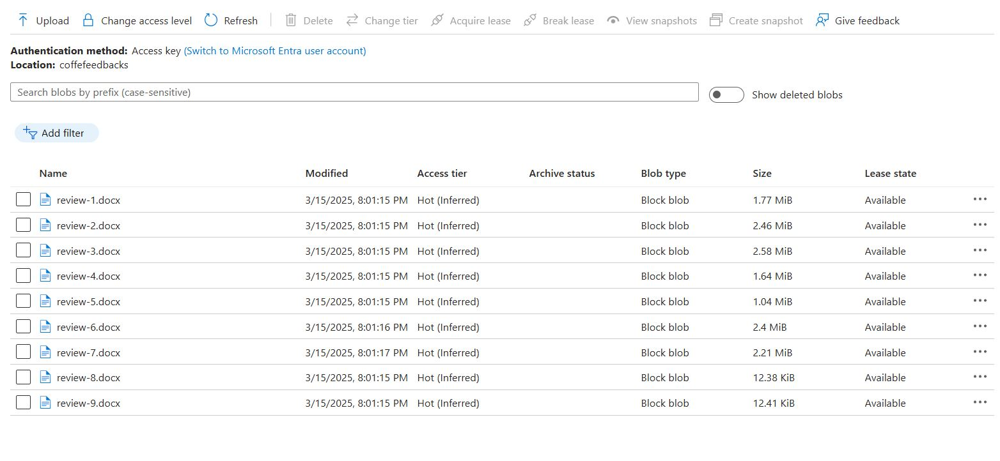
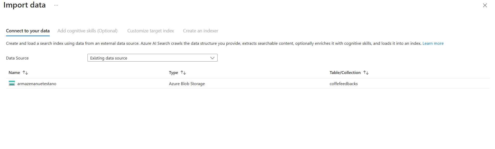
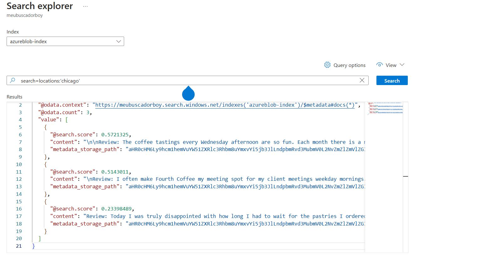

# Coffe Reviews
----

## Primeiro passo: 

### Criar um serviço de busca e um serviço de armazenamento.

## Segundo passo: 

### Alimentar o container de dados:

## Terceiro passo: 

### Linkar o buscador com nossa base de dados:

## Quarto passo: 

### Realizar nossas buscas:
#### No exemplo, buscamos todos os reviews de Chicago: 

